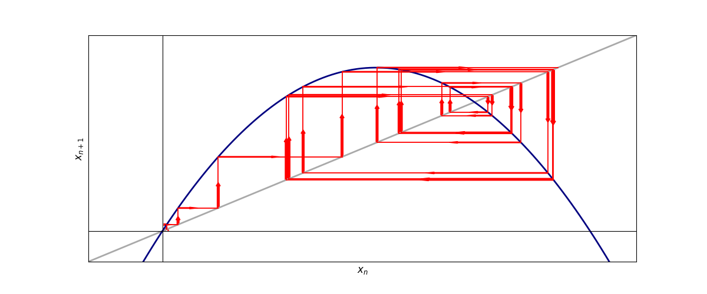

# Cobweb

The repository contains code for experimenting with non-linear dynamical systems in Python. The code is based on the book [Nonlinear Dynamics and Chaos](https://www.stevenstrogatz.com/books/nonlinear-dynamics-and-chaos-with-applications-to-physics-biology-chemistry-and-engineering) by Steven Strogatz.

## Running the Code

This repository uses the [uv](https://docs.astral.sh/uv/) package manager. To use it, you must first install `uv` using the `pip` package manager.

```bash
pip install uv
```

Once you have `uv` installed, you can run the code using the following command:

```bash
uv run src/main.py
```

## Example Diagrams

The following diagram was generated using the `cobweb` crate, run using the above command:




