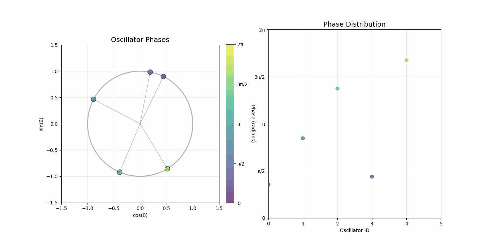
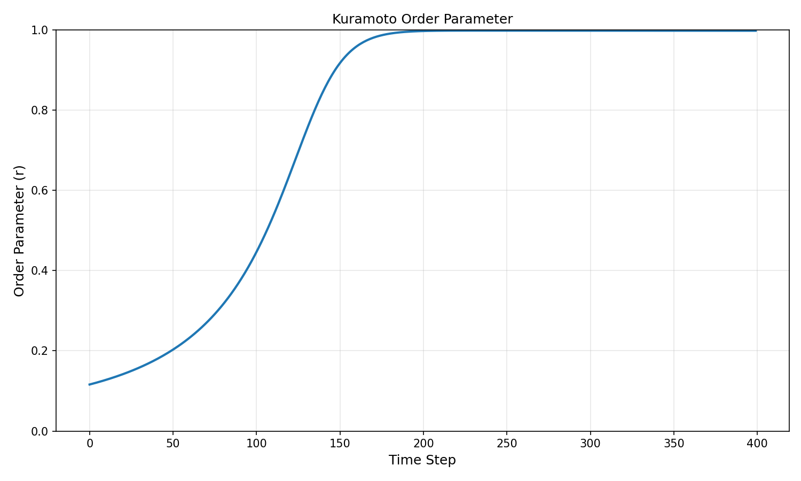

# Kuramoto

This package is a Rust implementation of the Kuramoto model, which is a mathematical model of synchronisation in a system of coupled oscillators. It is governed by the following set of equations:

$$
\dot{\theta}_i = \omega_i + \frac{K}{N} \sum_{j=1}^{N} \sin(\theta_j - \theta_i)
$$

where $\theta_i$ is the phase of the $i$-th oscillator, $\omega_i$ is the natural frequency of the $i$-th oscillator, $K$ is the coupling strength, and $N$ is the number of oscillators.

These oscillators evolve dynamically on the unit circle and (in the case below) can converge over time to become in phase:



## Running

To run this code, ensure you have Rust and Cargo installed. Once the environment is set up, you can execute the program using the following steps:

```bash
cargo run
```

This command will compile the implementation of the Kuramoto model and run the program, generating an output parquet file `kuramoto.pq`.

## Plotting

The plotting library is written in Python and is contained in `utils/`, you can generate the plots above using the `uv` package manager:

```bash
cd utils/
uv run main.py
```

This will generate a .GIF animation for the evolution of the system and a plot of the convergence of the order parameter of the system over time:



## Discretisation

This differential equation can be discretised in time to give the following forward-Euler update:

$$
\theta_i(t + \Delta t) = \theta_i(t) + \Delta t \left( \omega_i + \frac{K}{N} \sum_{j=1}^{N} \sin(\theta_j(t) - \theta_i(t)) \right)
$$

The package contained herein contains a simple implementation of this forward Euler update starting from a random normal configuration.
